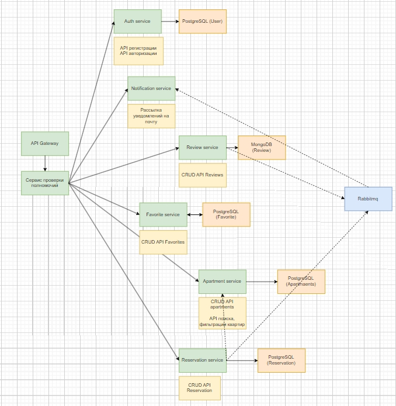

# Сервис аренды квартир
## Проект представляет собой сервис построенный с использованием архитектуры микросервисов.

[Deploy](Deploy/)

### Состав микросервисов

1. [**apartment-service**](Services/apartment-service/)
   - Управляет информацией о квартирах: добавление, редактирование, удаление.

2. [**favorite-service**](Services/favorite-service/)
   - Добавляет квартиры в избранное для зарегистрированных пользователей.

3. [**notification-service**](Services/notification-service/)
   - Отправляет уведомления на почту.
   - Взаимодействует с RabbitMQ для обмена данными.

4. [**policy-enforcement-service**](Services/policy-enforcement-service/)
   - Контролирует политики прав доступа.

5. [**reservation-service**](Services/reservation-service/)
   - Управляет бронированием квартир.
   - При создании брони отправляет данные о бронировании в **notification-service** с помощью RabbitMQ.

6. [**review-service**](Services/review-service/)
   - Позволяет пользователям оставлять отзывы о квартирах.
   - При добавлении отзыва присылает уведомление владельцу квартиры в **notification-service** с помощью RabbitMQ.

7. [**user-service**](Services/user-service/)
   - Используется для работы с пользователями.
   - Построен на базе fastapi-users.


## Диаграмма проекта



# Инструкция по запуску процесса поиска уязвимостей

## Анализ исходного кода сервисов с помощью Bandit
1) Установить bandit:
```sh
pip install bandit
```
2) Запустить проверку в нужной дериктории
```sh
python3 -m bandit -r ./dir
```

## Анализ докер образов с помощью Trivy
Нужно просто запустить эту команду и вписать название интересующего образа вместо IMAGE_NAME
```sh
docker run --rm -v /var/run/docker.sock:/var/run/docker.sock aquasec/trivy image IMAGE_NAME
```
Если не работает то попробуйте в начале прописать эту команду
```sh
docker pull aquasec/trivy
```